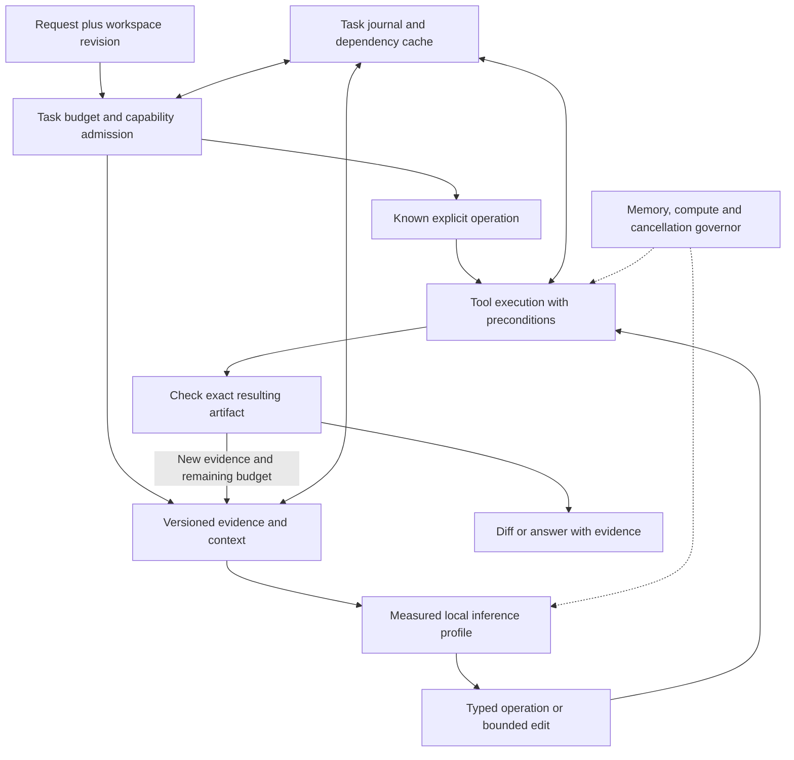

# Deep research: fast local AI mechanisms, architecture and build decisions

> Research snapshot: 7 October 2026. [Original Page](https://chatgpt.com/space/page_be878743f72481919968667743827fcc). This document records evidence, hypotheses, and proposed experiments. Implemented scope is described in the [repository README](../../README.md); proposals are not measured product capabilities. The [evaluation contract](evaluation-contract.md) governs qualification where older research language differs.

Research date: **7 October 2026**. This is the expanded research and decision record for a fast local AI system on ordinary **8–16 GB consumer laptops**, with **pluggable GGUF brains**, coding as the first demanding workload, and a shared foundation for general assistance.

The earlier overview was too coarse to justify an implementation. This revision investigates mechanisms, their costs, requirements, failure modes, interactions and falsifiable experiments. It does not claim a universally optimal architecture or measured laptop speedups. The attached execution environment is still offline, so this turn could inspect primary sources and current runtime code but could not run local benchmarks or inspect the user's PC.

**Recommendation:** build an incremental task engine around a measured local inference backend. Use language models for decisions and content that need generation; reuse validated evidence and operations; let language servers, parsers, search and tests perform their native work. Allocate memory, context, threads, optional models and verification as one coordinated budget.

**Version 1 goal and evaluation contract:** the [project goals and comparison protocol](evaluation-contract.md) defines the 2× median completion target, quality and resource requirements, baseline selection, task suites, statistical claims, and the failure-to-revision process. Use it to govern implementation and experiment promotion; its explicit suite counts replace the earlier smoke-suite proposal.

**Research dossiers**

| Dossier | Coverage |
| --- | --- |
| [Project goals and comparison protocol](evaluation-contract.md) | Version 1 targets, strong conventional comparators, task acceptance, statistical gates, harness contracts and failure revision rules |
| [Model mechanisms](model-mechanisms.md) | Dense/MoE, attention and recurrent state, quantization, binary/ternary models, format compatibility, routing, specialization |
| [Hardware and inference](hardware-inference.md) | Kernels, threads, memory mapping, shared memory, accelerators, caches, batching, thermal and power behavior |
| [Decoding and generation](decoding-generation.md) | Speculative methods, exactness, verification cost, source-copy proposals, edit formats, grammars and reasoning budgets |
| [Context and reusable work](context-reuse.md) | Retrieval, incremental indexing, state caches, invalidation, tool selection, compression and workflow memory |
| [Execution and coding architecture](execution-coding.md) | Plans, tool contracts, semantic editing, validation, cancellation, recovery and implementation tradeoffs |
| [Frontier experiments](frontier-experiments.md) | Twelve prototype programs and four bounded probes: source drafts, compiled workflows, synthesis, sparse working sets, dynamic precision, phase scheduling, tiny controllers, learned memory, adapters, recursion and diffusion |

These dossiers are part of this research, not optional future work. Read this decision record first, then the mechanism dossier for an implementation under consideration.

## 1. Evidence standard and what changed

Four labels prevent unsupported speed claims:

- **Inspected implementation:** behavior found in current runtime source or official documentation. It still needs a pinned-build probe on our platform.

- **Published experiment:** a result obtained on identified hardware, models, workloads and baselines. Transfer to our laptop is a hypothesis.

- **Derived cost:** a calculation from explicit assumptions, useful for ruling out an impossible or unprofitable configuration.

- **Design proposal:** a mechanism we intend to test; no measured gain is implied.

Mutable documentation and source were consulted on the research date. The build stage must record exact commits, artifacts, compiler flags and drivers. A current feature name is not proof of support by an older packaged binary.

The deeper investigation changes several earlier recommendations. A GGUF can load successfully while requiring a missing activation transform. Hybrid models support some state reuse but need architecture-specific rollback. Quantized KV is constrained by attention kernels and head dimensions. Integrated GPUs differ in actual buffer allocation and copying. Current speculative methods extend beyond plain draft models and n-grams, but their break-even condition depends on verification cost. TinyAgent's small-model result is tool-set-specific. A coordinator language rewrite has no established performance benefit without profiling.

**Corrections to the overview:** Rust/Tauri are candidates, not mandatory architecture; a universal 20% promotion threshold is too crude; 50 tasks are enough for an initial smoke study, not proof of small quality differences or rare-error rates; and weights fitting in RAM does not prove the whole coding workflow fits.

## 2. The governing cost model

Measure a complete task:

T = queue + load/switch + context construction + uncached prefill + decode + tools + validation + repair + user correction.

Overlapping work contributes its critical path rather than the sum of all worker times. A task that produces a wrong answer quickly is a failure, not a successful low-latency observation.

Track separate events: request accepted; first visible acknowledgement; first model token; first useful action; candidate artifact ready; verified result ready; cancellation acknowledged; resources actually released. A token from hidden reasoning does not mean the user has received useful progress.

For a rough inference bound, per-step time is at least the larger of bytes moved divided by sustainable bandwidth and required arithmetic divided by sustainable compute, plus launch, synchronization and sampling overhead. Those bandwidth and compute values must be measured for the actual kernels; advertised peak bandwidth or TOPS is not the effective rate.

Two useful limits:

1. If decode occupies 60% of total latency, doubling decode speed yields at most 1/(0.4 + 0.6/2) = 1.43× overall speedup before other effects.

2. Removing 200 generated tokens at a measured 20 tokens/second would save about 10 seconds of decoding, provided the alternative does not add equivalent processing or extra failures.

These are illustrative calculations, not benchmark results. They explain why native operations and compact outputs can matter as much as inference optimization.

**Objective:** maximize reliable tasks completed per unit of user time and energy within a hard memory/responsiveness budget. Report quality, latency, memory and energy separately. Keep a Pareto frontier instead of hiding tradeoffs in a single arbitrary score.

## 3. Architecture and stable boundaries

The first inference adapter should use a pinned llama.cpp server because it gives us an inspectable, replaceable GGUF path. Keep the host interface small: discover capabilities, load, tokenize/render, generate, cancel, unload, inspect metrics and manage explicitly supported state. Runtime-specific extensions remain behind the adapter. Do not treat a nominally OpenAI-compatible endpoint as proof of identical tool, cache, reasoning or cancellation semantics.

Use the existing repository's language and conventions for the prototype unless measured overhead justifies a native component. Rust is a reasonable future native-core option; Python, TypeScript or another existing host can be a valid baseline when inference and tools dominate. Direct libllama integration becomes worthwhile only for a required capability or measured transport overhead. Tauri is a packaging candidate after the core succeeds.

The state/index layer can begin with SQLite plus local content-addressed artifacts. Keep model-state caches, retrieval indexes, tool results and validated procedures logically distinct. Each has a different identity, lifetime and correctness contract.

**Boundary invariants:** a model proposes; the coordinator owns task state; tools act only on validated arguments and current source; the verifier checks the resulting artifact; the governor can stop or postpone work; the interface reports confirmed state instead of inferring success from text.

## 4. Request execution as incremental work

A coding request should produce a small dependency graph only when it needs one. Nodes can be locate, read, inspect symbol, generate bounded edit, apply, run check and summarize. A direct command such as an explicit symbol rename can enter a validated native path. Ambiguous natural language requires interpretation; the fast path must not invent user intent.

Each proposed operation carries, conceptually:

| Field | Purpose |
| --- | --- |
| Task ID, epoch and operation ID | Reject stale events and distinguish retries |
| Dependencies | Prevent executing before required evidence exists |
| Tool and typed arguments | Avoid parsing free-form operational prose |
| Source/artifact identities | Bind action to the exact workspace state |
| Read/write scope | Admit conflicts and resource requirements |
| Preconditions | Detect stale files, missing symbols or changed configuration |
| Expected result and validation | Define completion independently of model confidence |
| Deadline and remaining budget | Bound speculation, generation, tools and repairs |
| Idempotency/replay policy | Avoid duplicate effects after interruption |

**Scheduling proposal:** allow independent cheap reads to overlap; initially admit one foreground decode job; budget compilers, language servers, indexers and encoders against the same laptop resources. A dependency graph does not make shared memory bandwidth parallel. Benchmark a sequential controller against the graph-based controller; retain the graph only where it removes model turns or overlaps useful independent work.

**Persistence proposal:** record operation state before and after effects and store artifact hashes. On restart, distinguish finished, failed and unknown outcomes. A cancelled operation may have produced partial effects. Reconcile those effects before replaying; cancellation is not an inverse operation.

This is an application of incremental computation and transaction discipline. Its novel value here is the combination with tested model profiles and hardware admission, not a claim to have invented dependency graphs.

**Repair allocation:** choose another model attempt only when there is new diagnostic evidence or a different justified strategy and remaining budget. The expected gain in accepted outcomes must repay generation and checking time. Set separate limits for tool retries, model repairs and total elapsed time; a failing tool should not trigger an unlimited loop of equivalent model calls. Preserve partial evidence when stopping.

## 5. How a coding task should use the mechanisms together

Consider: “Rename the retry delay field and cap the delay at five seconds.”

1. Locate definitions and references using symbols and lexical search. Retrieve the relevant type, units, tests and configuration. If the field is milliseconds, five seconds means 5,000; if units are unclear, resolve them from evidence before applying a constant.

2. Use the language server's rename operation when supported. Respect document versions and position encodings; textual replacement cannot establish symbol identity.

3. Ask the model only for the uncertain behavior change, with a constrained edit boundary and enough surrounding contracts.

4. Apply the result against exact source preconditions in an isolated working area. Do not silently fuzzy-apply an edit to a different version.

5. Run syntax/type checks and relevant behavioral tests against the exact candidate. Preserve the original trusted checks; a patch that weakens its own verifier has not established correctness.

6. If a check fails, provide the compact error and changed dependency context for a bounded repair. Repeating the same failed attempt without new evidence is not progress.

7. Return the diff and verification status, including any remaining uncertainty.

For a large rewrite, source-as-draft speculation may be useful because unchanged stretches are predictable. For a small local edit, a bounded replacement may eliminate more work. Test both; speculative full-file rewriting is not automatically superior to emitting a small edit.

**Transactional limit:** a Git worktree separates working files but is not an OS sandbox, and multiple ordinary filesystem writes are not inherently one atomic transaction. Use staged candidates, version checks and explicit recovery. A worker must not overwrite concurrent user changes to save a retry.

**General assistance:** reuse the same pattern. Retrieve document evidence with locations, calculate data results using native tools, preserve source freshness for web research, and generate the explanation from checked results. Multimodal encoders load only when needed and admitted.

## 6. Four useful departures worth prioritizing

### 6.1 Let deterministic software remove model work

Use explicit operations, compiler facts, parsers, search and native calculations to avoid rediscovering facts or regenerating unchanged material. The output of a model can be a small typed decision or edit rather than a narrated sequence of shell instructions.

**Hypothesis:** fewer tokens and invalid actions reduce complete-task latency enough to outweigh tool preparation. Test on bounded edits, migrations and document/data tasks. The method may offer little benefit for open-ended design or creative writing, so preserve a general generation path.

### 6.2 Treat reuse as a dependency problem

Cache evidence and successful procedures with declared dependencies, including negative search results and tool configuration. Invalidate when the files, corpus, model profile or relevant environment change. A task epoch can keep its stable prompt prefix while new observations append after it.

**Hypothesis:** reuse can eliminate entire model/tool steps safely on repeated local work. Test unchanged work, a changed dependency and a newly added matching file. A cache that is fast because it misses changes is invalid.

### 6.3 Match compressed brains to actual kernels and state costs

Test trained binary/ternary models against conventional quants under a total-memory and task-quality budget. Pair them with current upstream kernels first. The lower weight traffic may make a larger parameter count practical, while attention, output-head work and sampling can become the next bottlenecks.

**Hypothesis:** an alternative low-bit brain expands the quality–latency frontier on weak hardware. Evidence must include full coding/general tasks and sustained operation, not just parameter storage.

### 6.4 Adapt speculation to the request and backend

Begin with measured source-copy/ngram opportunities. Try model-specific drafts only when compatible and memory-admissible. Estimate accepted progress per verification cost, shrink or disable speculation when it loses, and retain an ordinary decode fallback.

**Hypothesis:** edit-heavy requests and backends with cheap batched verification can benefit. Small quantized CPU targets may already be fast enough that a draft model or large verification batch hurts.

These are prioritized research proposals. They do not establish a multiplier, and their benefits must not be multiplied together without an integrated experiment.

## 7. Interaction matrix: optimizations are not independent

| Combination | Helpful interaction | Failure to test |
| --- | --- | --- |
| Smaller context + retrieval | Less prefill, attention work and state | Relevant dependency omitted; extra repair exceeds savings |
| Stable prefix + dynamic tools | Cached instructions with narrow tool choice | Schema change near prompt start invalidates the reusable prefix |
| Hybrid state + speculation | Lower growing cache footprint | Rejected drafts need unsupported or expensive rollback |
| Low-bit weights + speculative drafts | Cheap draft and reduced target traffic | Verification kernels scale nearly linearly with proposed tokens |
| Quantized KV + Flash Attention | Lower retained cache and possibly traffic | Unsupported head shape/backend; precision or kernel regression |
| CPU + integrated GPU | Suitable operations placed on faster device | Copies, synchronization and shared bandwidth exceed benefit |
| More threads + concurrent tests | Potential overlap of independent work | Oversubscription, thermal throttling, memory contention |
| Model routing + one resident model | Cheap model handles common tasks | Swaps and rebuilt context erase expected savings |
| Embeddings/reranker + small RAM | Better semantic recall | Extra residency/loading crowds out useful context or tools |
| Procedure memory + evolving repo | Reuse of validated steps | Changed preconditions silently produce a wrong effect |
| Batching + interactive priority | Better arithmetic intensity | Throughput improves while foreground tail latency worsens |
| Aggressive cancellation + state reuse | Stop obsolete work early | Inference continues remotely or cached state reflects partial work |
| GUI/editor + inference | Immediate progress and bounded edits | UI or language-server memory was excluded from benchmarks |
| KV eviction/prompt compression + coding | Smaller state/input | Deleted identifier, constraint or earlier dependency changes correctness |

**Admission rule:** a mechanism is enabled for a specific model × quantization × backend × context × workload profile. Availability in any one profile is not a global capability.

**Testing rule:** after individual winners are found, rerun their critical interactions. Single-factor improvements measured against the same old baseline cannot simply be added together.

## 8. Resource governor and operating profiles

The governor should use observed memory and latency, not only static parameter counts. Budget model weights, attention and recurrent state, checkpoints, workspaces, duplicated device buffers, host application, language servers, indexes and the peak of admitted tools. On unified memory systems, distinguish shared physical pages from genuinely duplicated allocations; adding every reported RSS and GPU number can double-count or miss allocations.

**Initial operating proposals, subject to measurements:**

| Profile | Starting configuration | Escalation |
| --- | --- | --- |
| 8 GB ordinary x86 laptop | One small fitting model; 2K–4K tested context; one decode; lexical/symbol retrieval | Larger or binary/ternary candidate only if tools and OS retain headroom |
| 16 GB ordinary x86 laptop | One 2B–4B candidate; begin at 4K context; benchmark CPU against supported iGPU | Increase context, add optional draft or stronger model only after total-budget checks |
| 8–16 GB Apple Silicon | Same task and memory constraints; benchmark Metal and CPU paths | Use Metal-specific capabilities only in a tested profile |
| Battery/thermal-constrained operation | Persist a lower-contention profile based on sustained tests | Defer indexing, large builds and optional accelerators when they hurt responsiveness |

These are starting points, not guarantees that every laptop in a RAM tier behaves alike. A low-bandwidth older machine, a fanless machine and a recent unified-memory machine need different decisions.

**Control policy:** prioritize an explicit foreground request; cancel obsolete completions when the source revision changes; pause background indexing under pressure; cap retained prompt/checkpoint caches; serialize high-memory operations when needed. Respond to sustained trends with hysteresis so the system does not constantly switch backends or models.

Do not promise success when a request exceeds the current budget. Shorten retrieved context only after preserving required evidence, choose a fitting profile if available, or report the capability boundary. Silently paging a larger model can destroy the speed objective.

**Calibration also has a cost.** If tuning takes 300 seconds and a new setting saves 0.1 seconds per future request, it needs roughly 3,000 comparable requests to repay that time, before energy and disruption. Start with a small staged sweep, reuse results keyed by hardware/driver/runtime/model, and retune only when a relevant component or sustained workload changes. An always-running autotuner would compete with the work it is meant to accelerate.

**Related research:** [EnerInfer](https://arxiv.org/html/2606.23001v2) studies joint energy, throughput and thermal control on selected devices. Its setup includes an in-house serving framework and platform-specific NPU/memory-frequency control; its user-experience thresholds do not establish a coding-completion target. The transferable lesson is to optimize sustained whole-system behavior. Our first governor uses application scheduling and supported settings; direct frequency control requires an available, explicitly qualified platform interface.

## 9. Benchmark design that can reject the architecture

There are three distinct test layers.

**A. Mechanism measurements:** load latency; prefill throughput at several lengths; decode latency with growing context; verification batch cost for K=1,2,4,8 where supported; cache hit/miss/restore cost; cancellation-to-release time; parser/search/LSP latency; memory and energy. These explain the cause of a change but do not establish product utility.

**B. Controlled tasks:** the same tasks, repository revisions, tools, prompts, model artifacts, seeds where meaningful, deadlines and verification. Vary one mechanism first. Include explicit failures and timeouts. A model swap or prompt redesign changes a different factor from an inference kernel.

**C. Interactive sessions:** related requests, interruptions, concurrent edits, cold starts, model switches, foreground builds and long sessions on AC and battery. These reveal warm-cache assumptions, state leaks and throttling.

Use the [version 1 evaluation contract](evaluation-contract.md): eight harness fixtures, a 60-case development pilot, and an initial 240-case qualification panel comprising 160 coding, 40 general, and 40 lifecycle cases. The primary task mix is 80% coding and 20% general assistance; lifecycle cases are a separate gate. These counts replace the earlier 50-case proposal. A fresh confirmatory sample is sized from pilot variability and paired disagreements before asserting the contract's narrow quality margin.

Then build a larger held-out set using fresh, reviewed tasks. Public coding benchmarks are useful controls but can contain contaminated or incorrectly scoped tasks. [SWE-rebench](https://arxiv.org/abs/2505.20411) addresses freshness; the [SWE-bench Verified audit](https://openai.com/index/why-we-no-longer-evaluate-swe-bench-verified/) documents problems that justify inspecting tasks rather than trusting a headline score.

MLPerf Client separates response performance and quality requirements, a useful precedent for refusing speed-only comparisons. Our complete coding tasks add editing, tools and validation beyond inference. [MLPerf Client](https://mlcommons.org/benchmarks/client/).

## 10. Measurement protocol and statistical limits

For every run retain hardware/OS/driver details, AC or battery mode, runtime commit/build, model and template hashes, context and sampling settings, task/repository identity, enabled mechanisms and all outcome/timing events.

Randomize or interleave A/B order; separate genuinely cold loading, warm filesystem cache and warm model state; log temperature or sustained-frequency indicators where available. Do not clear system caches casually on the user's working laptop. If cold-cache control is unavailable, label that condition honestly. Use repetitions for timing variance, but do not count ten repeats of one task as ten independent tasks for quality confidence.

Record median and tail latency, task success, false acceptance, repair count, source preservation, peak memory, paging, total energy and energy per accepted task. Report failures and censored/time-limited tasks rather than computing latency only on convenient successes. Battery drain over a short interval is noisy; prefer supported energy counters or sufficiently long controlled sessions, and label estimates.

**Statistical caution:** at 50 independent tasks, a success proportion near 50% has an approximate 95% margin around ±14 percentage points. That cannot prove a two-percentage-point noninferiority claim. With zero observed independent failures, the rough 95% upper bound is 3/n; 50 clean cases still allow a failure rate around 6%. Repeated similar fixtures and correlated tasks weaken those assurances further.

Use paired task comparisons and confidence intervals clustered by task/repository where appropriate. Predeclare an acceptable quality margin by workload, especially for false acceptance and stale edits. Expand the sample when a small difference determines a deployment decision. Inspect regression examples rather than relying only on aggregate significance.

**Revised promotion rule:** a change must be compatible and correct, stay within the resource envelope, meet the declared quality criterion, and improve a user-relevant metric enough to justify its complexity. The old universal “20% faster” rule is replaced by mechanism-specific gates. A low-risk setting can justify a modest gain; a custom runtime fork needs a substantially stronger and repeatable benefit.

## 11. Experiment queue and decision gates

| ID | Comparison | Primary question | Ship condition |
| --- | --- | --- | --- |
| E0 | Current minimal agent versus proposed minimal adapter, same model | Is orchestration itself a bottleneck? | No unjustified framework rewrite; complete trace available |
| E1 | Small conventional candidate set | Which brain meets coding/general quality while fitting? | Profile-specific quality–latency frontier |
| E2 | CPU threads and backend sweep | What really limits prefill and decode? | Repeatable sustained gain with responsiveness preserved |
| E3 | Context sizes, exact prefix reuse and cache caps | Does less recomputation beat state overhead? | Correct cache hits/invalidation and lower complete-task time |
| E4 | Free-form edits versus bounded/LSP operations | Can deterministic tools eliminate generation and failures? | Better accepted outcomes; zero stale-application failures in adversarial fixtures |
| E5 | Lexical/symbol retrieval versus hybrid retrieval | Is semantic recall the actual gap? | Recall/quality gain repays indexing, loading and reranking cost |
| E6 | Ordinary decode versus ngram/source-copy speculation | Is copying old code profitable? | Lower accepted-task latency at unchanged semantic requirements |
| E7 | Compatible neural draft methods | Is accepted progress worth draft plus verification and state cost? | Positive measured break-even and complete quality/cancellation checks |
| E8 | Conventional Q4 versus trained binary/ternary | Does compressed capacity improve useful capability per budget? | Whole-task gain on weak target, not only weight-size gain |
| E9 | Cold work versus guarded evidence/procedure reuse | Can entire steps be skipped safely? | Correct invalidation and repeat-work gains |
| E10 | KV precision, attention kernels, hybrid checkpoints | Can state traffic be reduced safely? | Supported build/backend; quality and rollback pass |
| E11 | Real session with builds, edits, interruption and battery mode | Do individual winners coexist? | No paging-driven stalls, orphan work or degraded task success |
| E12 | Optional NPU, T-MAC or deeper decoding integration | Is specialization worth another backend? | Clear win over current baseline after setup and maintenance costs |

**Two concurrent tracks:** E0–E3 establish trustworthy measurements and compatibility. As soon as those controls exist, begin small frontier prototypes alongside the useful coding path; they do not have to wait for a finished product. E4–E10 qualify work selection, state and decoding mechanisms, while E11 tests their combination. Specialized kernel/model experiments such as E12 first test their most uncertain enabling assumption, then expand only after that result is promising. Novelty earns an experiment before it earns default deployment.

Each experiment has a rollback: use the last validated profile. Calibration may update a profile, but it must not silently enable an untested model transform, schema, approximate cache or background model.

## 12. Build roadmap with concrete exit conditions

| Stage | Deliverable | Exit condition |
| --- | --- | --- |
| 0. Inspect and measure | Read actual project instructions and architecture; inventory target laptop; pin artifacts; save a benchmark spec | Known baseline, dominant costs, resource envelope and reproducible run manifest |
| 1. Runtime compatibility | Small adapter; import two GGUF profiles; streaming, tokenization, cancellation, switch and crash recovery | Both models operate through the same contract; incompatible profiles reject clearly |
| 2. First useful coding path | Locate, inspect, bounded edit, validate and show diff | Real task completed on weakest reference laptop without stale writes or hidden failures |
| 3. Incremental evidence | Symbol/lexical retrieval, artifact identities, dependency invalidation and exact supported state reuse | Repeated work improves; adversarial file/config changes invalidate correctly |
| 4. Native coding operations | LSP rename/code actions and relevant behavioral verification | Reduced generation or repair on measured tasks; unsupported cases fall back clearly |
| 5. Hardware and speculation tournament | Measured backend/thread profiles; ngram and compatible neural drafts; low-bit candidates | Only demonstrated winners become defaults for their profiles |
| 6. Integrated operating policy | Resource admission, cancellation, bounded retries, session persistence and thermal/battery modes | Long mixed sessions preserve correctness, responsiveness and memory headroom |
| 7. General assistance and interface | Grounded documents, native data operations, optional web/modality tools, editor or lightweight UI | Shared core works without unnecessary permanent residency |
| 8. Specialization if justified | Curated traces, selective distillation/adapters, custom kernels or deeper runtime integration | Held-out benefit repays training and maintenance; general fallback remains available |

A calendar estimate would be false precision before inspecting the repository and hardware. Stages 0–2 form the first useful build milestone. In parallel, run the smallest decisive prototypes from the frontier experimental program once measurement and compatibility controls exist. Later numbered stages describe production integration order, not a ban on earlier research into custom kernels, new model architectures or unconventional memory systems.

**First milestone acceptance:** import and switch between two verified profiles; complete a small real fix; preserve concurrent user edits; display the diff and check evidence; cancel obsolete work; remain within the measured memory envelope. This is a concrete start, not a requirement to build every subsystem before useful work exists.

## 13. Choices to keep conditional or exclude initially

| Mechanism | Initial decision | Reason |
| --- | --- | --- |
| Many local model agents running together | Exclude from baseline | Shared memory/compute contention and extra tokens; parallel tool I/O is different |
| Large model paging through SSD | Exclude from speed baseline | Capacity workaround with transfer/tail costs; specialized sparse engines are separate research |
| Learned retriever/reranker always resident | Conditional | Recall may justify it, but memory and loading must be measured |
| Learned prompt compression and approximate KV eviction | Conditional later | Can remove exact identifiers, constraints and cross-file evidence |
| GPU/NPU enabled because hardware advertises high TOPS | Exclude as a policy | Actual graph, kernels, copies and driver support determine utility |
| Native-core rewrite | Conditional | First establish that host overhead matters |
| Whole-model pretraining or aggressive custom QAT | Defer | Existing candidates can test the architecture much more cheaply |
| Autonomous continual reflection or self-improvement loops | Defer | Spend inference and may preserve mistakes; validated procedures have a narrower claim |
| Remote cloud escalation | Outside the local baseline | User's target is consumer-local speed; can be a separately authorized optional adapter |
| Universal speed multiplier | Reject | Mechanisms overlap and bottlenecks move |

The system should be extensible at a few real boundaries, not abstract every library or hide feature differences behind a misleading universal interface.

## 14. Frontier program: test unconventional mechanisms alongside the baseline

The [frontier experiment dossier](frontier-experiments.md) adds twelve concrete prototype programs and four bounded probes. Each identifies an artifact, the assumption being challenged, the smallest informative test, required runtime changes, memory costs, comparison conditions, and a stopping criterion. These are proposed experiments, not reproduced laptop results.

The first three branches are source-directed linear drafts, fully resident SmallThinker with its approximate LM-head predictor disabled, and a narrow FunctionGemma action controller. They test three different opportunities: propose tokens without a second neural model; exploit a model trained for sparse computation; and avoid invoking the general brain for frequent semantic operations. SmallThinker's SSD path is a later ablation of the same branch, because its own published results demonstrate severe slowdowns on some memory-constrained hardware.

In parallel, compile three repeated workflows into dependency-aware programs and test model-guided synthesis for small pure expressions. These approaches can eliminate reasoning turns or replace repeated repairs with bounded search. Follow with mistake-only code memory, diffusion patches, reusable documentation adapters, and measured CPU/accelerator phase specialization. Nested-precision kernels, adaptive recursion, and small Engram-style learned tables receive reference/operator tests before larger integration or training.

The roadmap has two tracks after the shared measurement harness: reliable execution and explicitly allocated experiments. An unconventional mechanism does not need to wait for a polished application. A positive reference result earns an optimized prototype; an optimized result earns broader device/task evaluation; that evaluation determines whether it becomes a default, a conditional option, or a retired branch. Timing estimates are planning allowances, not promises.

GGUF remains the main model path, while the runtime exposes optional capabilities for draft verification, hidden-state access, logits intervention, adapter lifecycle, block denoising, recurrent state, and state transfer. Backends declare what they support. This prevents a text-only abstraction from blocking the experiments without pretending that tensor format compatibility supplies missing operators.

The first build deliverables are therefore the replayable task harness, a minimal compatible GGUF path, and those first experimental prototypes. The hypothesis is that removing repeated work and improving useful capability per byte can combine with faster inference. Their speedups must be measured together; they cannot be multiplied from independent papers.

## 15. Remaining uncertainty and handoff

The most consequential unknowns are the exact laptop, actual project structure, task distribution, model/tool quality, sustained bandwidth and thermal behavior, backend compatibility, verification-batch cost, and how much repeated work occurs in practice. These are specified measurements in the roadmap, not reasons to postpone all useful design.

Matt Pocock's relevant research and codebase-design skill texts were fetched and read earlier. Persistent skill installation still requires a functioning executor; PC-local skills cannot be accessed through an offline cloud workspace. No account setting, model entitlement or platform limit was changed. No product implementation or laptop benchmark is represented as completed.

The output of this turn is a source-backed research package, explicit corrections, a mechanism interaction model, a benchmark protocol and an implementation sequence. The next build should begin by testing the cheapest falsifiable assumptions, then retain only what improves correct task completion on the target laptop.
