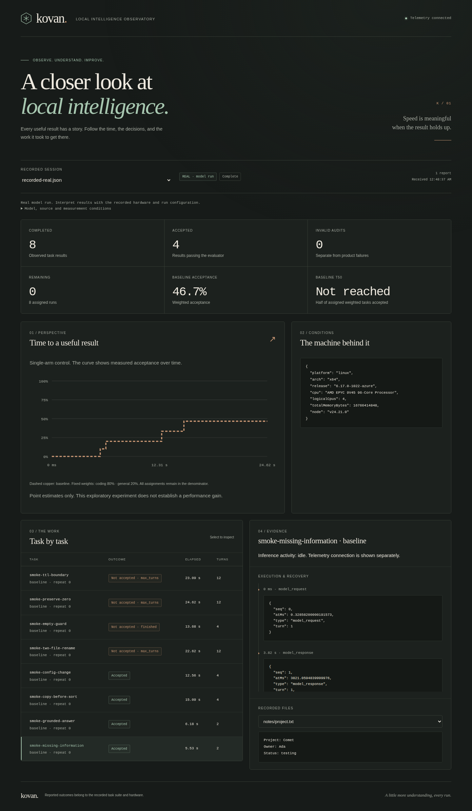

# Mac handoff validation

Target: Apple M5 with 16 GB unified memory. The actual target device was not available.

Implementation tested at [9a2a73e](https://github.com/virideanil/ailab/commit/9a2a73e3d37bc0881bcc14201a24f537cb4c3070).
[Validation run](https://github.com/virideanil/ailab/actions/runs/37709612712) completed successfully on 8 October 2026.

- Hosted macOS and Linux: 102 tests passed on each, zero failures. Each ordinary unit run skipped one explicitly opt-in Docker suite.
- [Linux isolation/admission job](https://github.com/virideanil/ailab/actions/runs/37709612799/job/113092176709): 112 tests passed, zero skipped; all 60 reference solutions passed and all 60 wrong starters were rejected. The unchanged smoke fixtures accepted all 16 scripted gold submissions. These are harness checks, not model performance.
- Chromium: live updates, real/fake labels, incomplete results, untrusted file text, desktop/mobile layouts and recorded-model screenshot passed. The screenshot below was visually inspected.
- Source packaging produced Mac ZIP, source tarball, SHA256SUMS and commit identity. Model weights and runtimes are installed separately.
- The launcher was exercised on hosted macOS; actual M5 Metal, Docker Desktop, memory pressure, thermal behavior and sustained accepted-task speed remain unmeasured.

The screenshot displays cohort 004 Coder 3B Research: 4/8 accepted. Its 46.7% weighted acceptance differs from the raw 50% count because the experiment assigns 80% weight to coding and 20% to general tasks. It is not a new result.

An earlier Linux check caught a fractional timer firing before its monotonic deadline. The fixed timer checks the remaining interval and rearms until the actual deadline. Original failed logs are retained in admission-failures/prefix-deadline-early-timer*.log. No smoke or private grading requirement changed.
